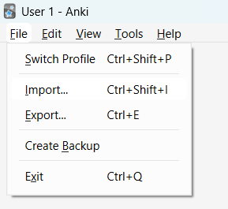
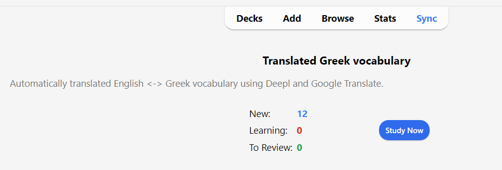
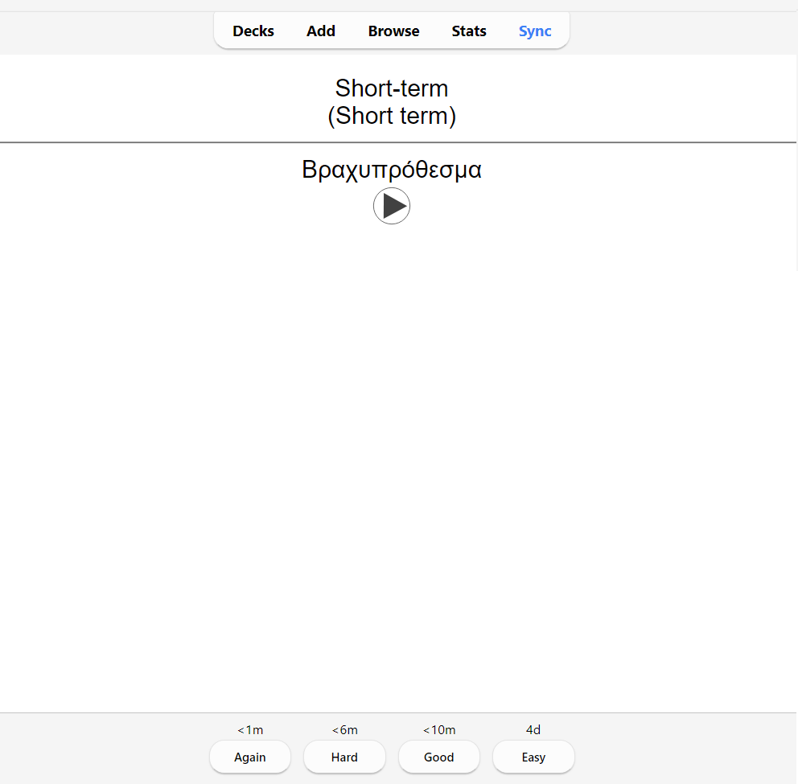

# Translated vocabulary Anki deck generator
If you're into language learning, you're probably familiar with [Anki](https://apps.ankiweb.net/) and other [Spaced Repetition](https://en.wikipedia.org/wiki/Spaced_repetition) flashcard apps. I've specifically found Anki to be very useful in maintaining a personal vocabulary of previously unknown words I encounter as I become more familiar with the language I'm learning and start using it in daily life. On top of whatever language basis I already have, that way I can make sure to focus my attention on practicing the words I personally use every day, rather than blindly practicing whatever set of words / phrases someone else has crafted for me to learn.

After doing this for a few languages, I realized that while the language I'm learning may change from time to time, the vocabulary of words I use on a daily basis does not! This presents me with a great opportunity: if I just keep track of my personal vocabulary in English (or any other base language you might prefer), all I need to do when learning a new language is translate my existing vocabulary into this new language of interest.

This tool does exactly that: given a list of words / phrases, it translates them to the target language using [Deepl](https://www.deepl.com/translator) and Google Translate, downloads text-to-speech sound files, and generates an Anki deck for you to practice with.
To make it easier to spot any translation mistakes, the output translations are translated back into a verification language of choice (usually the same as the source language), and added to the cards as well.

The output is saved both as an Anki deck `.apkg` file and a zip file, so this program may be useful even if you don't use Anki! You'll still have access to a nicely bundled translated vocabulary with text-to-speech files, you'll just need to make it work with whatever app you prefer.

## Getting started
I appreciate not everyone may be familiar with [Python](https://www.python.org/), the programming language in which this code was written. If you have no idea what I'm talking about, just head to https://www.python.org/downloads/ and download the latest version for your operating system. You will also need to create a free [Deepl API account](https://www.deepl.com/pro-api?cta=header-pro-api).

Then, download (and unzip) the code of this project by pressing the big green `<> Code` button here on GitHub, at the top of the page.
Open the folder you've downloaded the code to, create a file called `.deepl_auth`, and paste in your Deepl API authentication key (found at the bottom of [this page](https://www.deepl.com/account/summary)).

And for the final preparation step, install the project requirements by running the following command in the downloaded folder (for example using [Command Prompt](https://stackoverflow.com/questions/40146104/is-there-a-way-to-open-command-prompt-in-current-folder) on Windows, or the [Terminal on Mac](https://macosx-faq.com/open-terminal-current-folder/)):
```bash
pip install -r requirements.txt
```

You're now ready to run the program! To get started, we'll use the example vocabulary I've provided in [Examples/vocab.csv](Examples/vocab.csv):
```csv
# ID    Phrase  	Tag1    Tag2    Etc
259	Short-term	Expression	Time
260	Medium-term	Expression	Time
261	Long-term	Expression	Time
262	At the end	Expression	Time
263	To be worth it	Expression	Verb
264	The mushroom (generic)	Food	Nature	Noun
```

As indicated by the top line, each line in this file contains a unique phrase ID (more about this below), the phrase to be translated, and any number of tags you want to add to the resulting Anki cards. All of them are seperated by a single `tab` character.

To test the program, run the following command from the folder you downloaded the code to:
```python
python cli.py --vocab-path=Examples/vocab.csv --target-language="el" --verification-language="en-gb" --deck-id=12345
```

This will:
- Tell the program to use the example vocabulary
- Set the target language to `el`: Greek.
- Set the verification language to `en-gb`: English (UK)
- Provide a unique identifier (`12345`) for this deck, so that Anki understands that this is a newly generated deck.

If everything goes well, you should see some progress bars and after a few seconds the results should be saved to a newly created `Output` folder! Import the generated `.apkg` Anki deck file into Anki (or transfer it to your phone and import it into the Anki app there):


You should now see a newly added deck called "Translated Greek vocabulary":


An example of one of the cards:



## Creating your own vocabulary
Now that you've seen how to create a translated Anki deck from the example vocabulary, it's time to make your own!
My example vocabulary contains words and phrases in English, but you can use any language supported by both Deepl and Google Translate.
To find out which languages are available, simply re-run the command above and play around with different values of `--target-language`, `--source-language` and `--verification-language`. If you happen to choose a language that doesn't exist (e.g. `--target-language=0`), the program will happily tell you which options you can choose from.

Creating a new vocabulary file is easy: just follow the example I've given in [`Examples/vocab.csv`](Examples/vocab.csv) and add each phrase on a new line. The tags can be handy if you like working with those in Anki, but if not, just leave those out.
For example, a very simple vocabulary might look like this:
```csv
1 My first phrase!
2 And another one!
3 What a time to be alive.
```

Don't forget to start each line with a unique number, otherwise Anki won't understand to which card each phrase belongs.

By default, the generated Anki deck will have both the original card (e.g. English->Greek) and a reverse card (e.g. Greek->English), but if you're only interested in learning one-way, simply add `--no-add-reverse-cards` to the command above.

I suggest running `python cli.py --help` to learn more about the available command options. If you run into any issues, feel free to open an issue on this GitHub project.

Happy learning!


## Future improvements
- At some point I'll need to update my deck as I add more words to my vocabulary. This would currently require re-translating the entire existing vocabulary, which is a waste of time and compute. I want to add an update function that only obtains translations for newly added vocabulary entries.
- Google Translate supports many more languages than Deepl does, so depending on the language you're trying to learn the current code may not work for you. It'd be nice to make Deepl translation optional, so that more people can benefit from just the Google Translate functionality. If this is something you urgently need, let me know by opening an issue on this GitHub project!
- It would be amazing to add support for verb conjugations, but manually adding those is an absolute pain.
Depending on the language of interest, it may be possible to use some conjugation website to automatically get all conjugations for a given verb.
